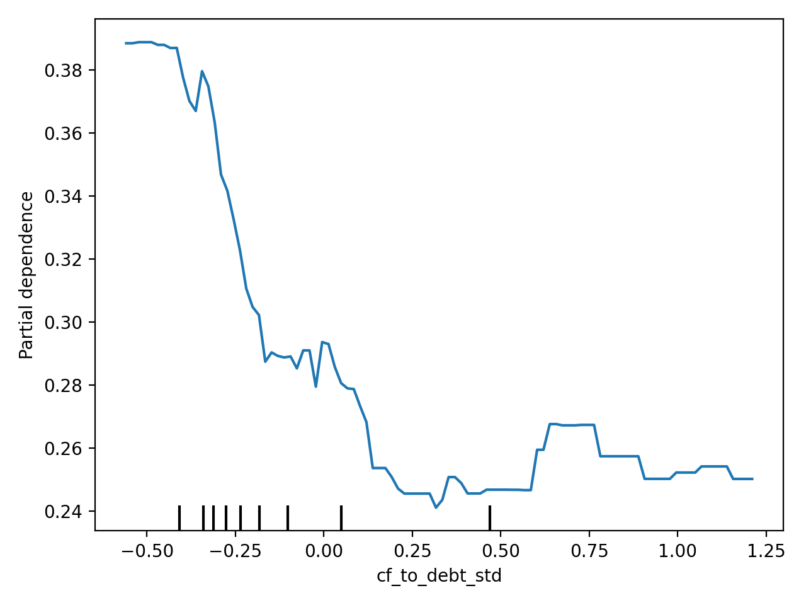
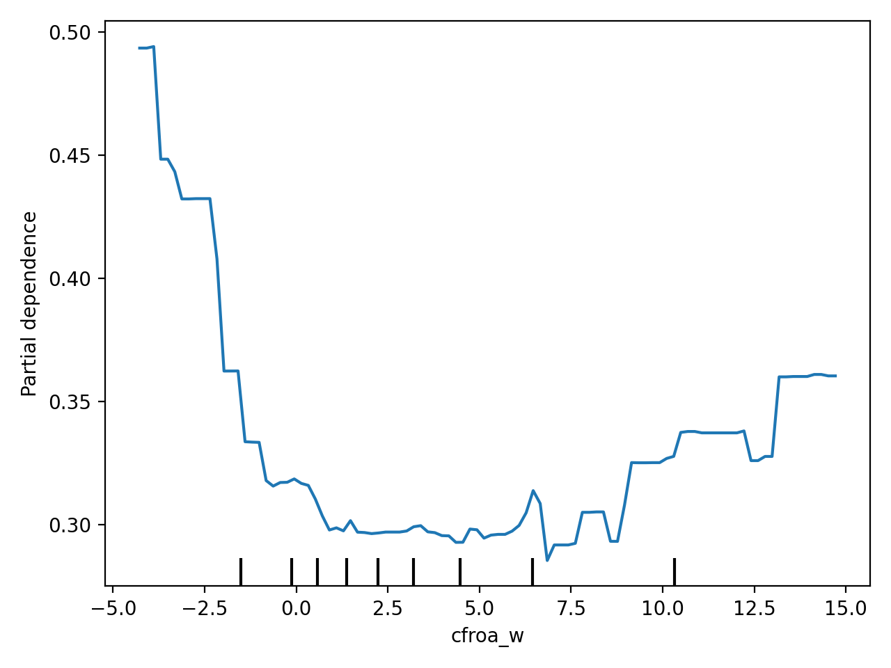
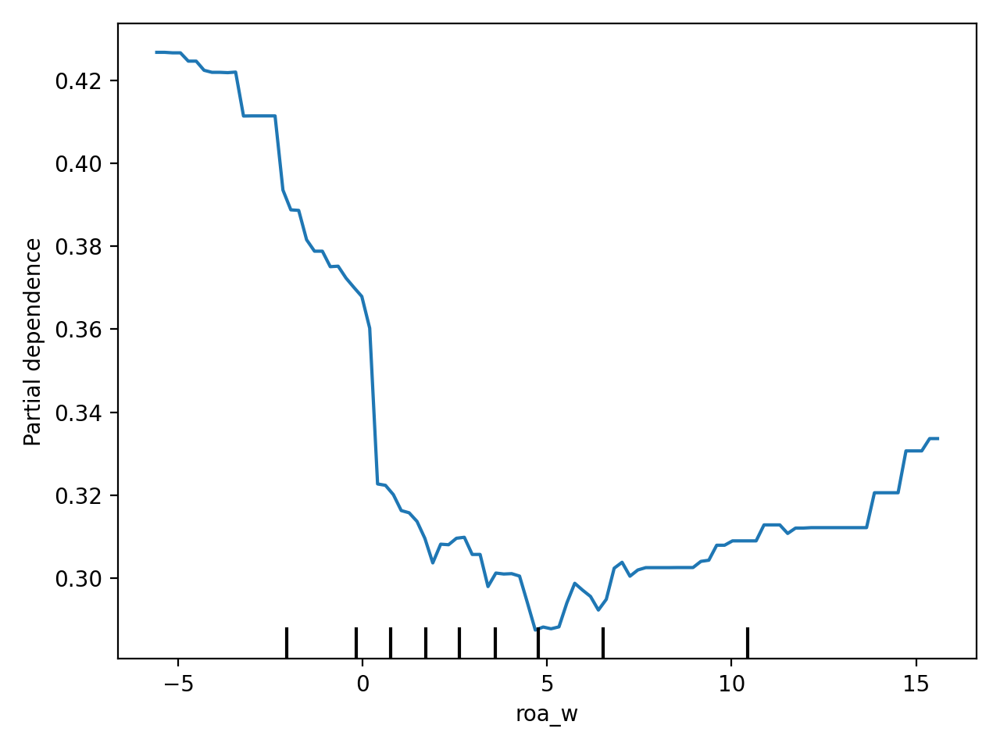
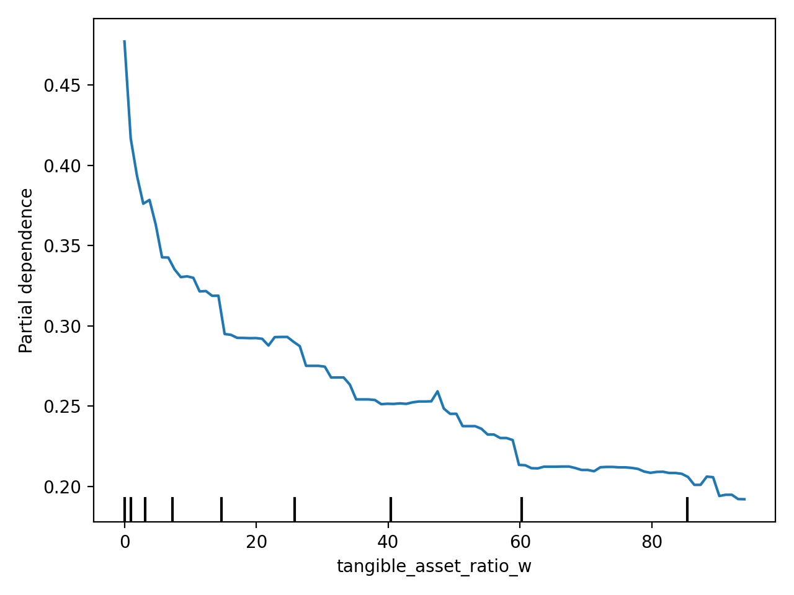
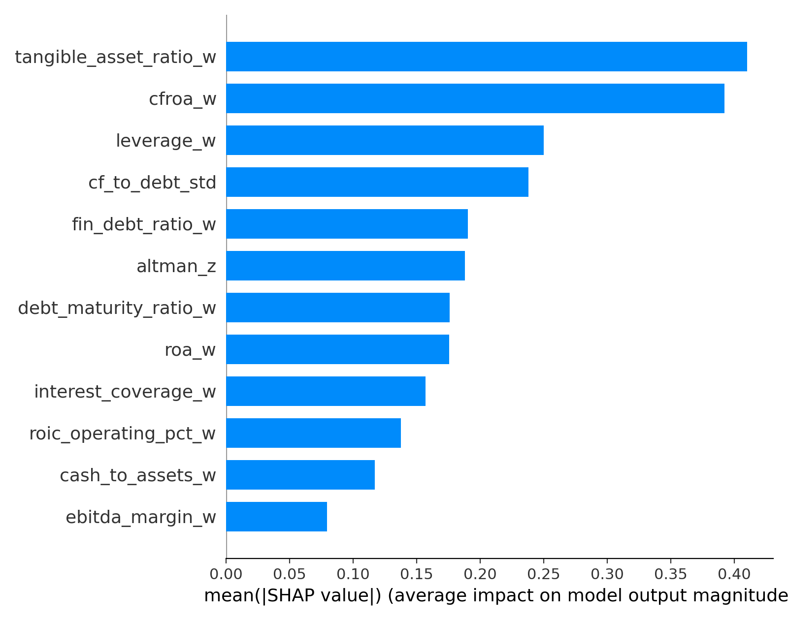

# Credit Risk Modeling for Corporate Default Prediction

**Team Lavender** | NYU ML in Finance  
Mustafa Poonawala · Yash Jadhav

> A two-stage, finance-aware credit risk pipeline: XGBoost discriminator + Isotonic Regression calibrator, validated with temporal walk-forward cross-validation.

---

## Results

| Evaluation Set | Mean AUC | 95% Bootstrap CI |
|---|---|---|
| Walk-Forward (4 folds, pooled) | **0.837** | [0.832, 0.840] |
| Calibration Holdout (2012) | **0.851** | [0.844, 0.859] |
| Training Set | **0.883** | [0.880, 0.887] |

**Calibration impact** (Isotonic Regression on temporal holdout):

| Metric | Before | After | Change |
|---|---|---|---|
| Brier Score | 0.136 | 0.012 | −91% |
| AUC | 0.850 | 0.851 | +0.001 |

**Walk-Forward fold detail:**

| Fold | Train Window | Val Window | n_train | n_val | AUC | 95% CI |
|---|---|---|---|---|---|---|
| 2008 | < 2008-05-01 | 2008–2009 | 144,333 | 161,514 | 0.828 | [0.818, 0.838] |
| 2009 | < 2009-05-01 | 2009–2010 | 305,847 | 170,706 | 0.838 | [0.830, 0.846] |
| 2010 | < 2010-05-01 | 2010–2011 | 476,553 | 174,837 | 0.830 | [0.823, 0.838] |
| 2011 | < 2011-05-01 | 2011–2012 | 651,390 | 184,347 | 0.850 | [0.842, 0.857] |

Baseline logistic regression achieved AUC 0.812 on the same dataset.

---

## The Business Problem

Banca Massiccia, a large Italian bank, needs reliable 12-month Probability of Default (PD) estimates for corporate borrowers to:

1. **Financial** — Price credit risk accurately (risk-based pricing via ECL = PD × LGD × EAD)
2. **Operational** — Replace slow, subjective manual underwriting with automated, consistent scoring
3. **Regulatory** — Satisfy IFRS 9 requirements for statistically valid, calibrated PDs

A simple classifier (approve/deny) is insufficient — the bank needs a true, usable probability.

---

## Two-Stage Pipeline

```
Raw Financial Data
       │
       ▼
┌─────────────────────────────┐
│   preprocessing.py          │
│   Preprocessing_Pipeline    │
│   • Reconstruct balance     │
│     sheet items             │
│   • Engineer 12 ratios      │
│   • Winsorize (1st/99th %)  │
│   • Standardize (CF/Debt)   │
└─────────────┬───────────────┘
              │  12 features
              ▼
┌─────────────────────────────┐
│   Stage 1: XGBoost          │
│   model.joblib              │
│   • binary:logistic         │
│   • scale_pos_weight ≈ 90   │
│   • max_depth = 4           │
│   • early stopping (75 rds) │
│   → raw score ∈ [0, 1]      │
└─────────────┬───────────────┘
              │
              ▼
┌─────────────────────────────┐
│   Stage 2: Isotonic Calib.  │
│   calibrator.joblib         │
│   • Trained on 12-month     │
│     temporal holdout        │
│   • Maps raw score →        │
│     true PD probability     │
└─────────────┬───────────────┘
              │
              ▼
        Calibrated PD
```

---

## Feature Engineering

All 12 features are winsorized financial ratios grounded in the Altman (1968) / Ohlson (1980) credit-risk literature. Parameters (percentile bounds, means, stds) are learned on training data only and stored in `artifacts/meta.json` to prevent leakage.

| Feature | Formula | Economic Signal |
|---|---|---|
| `leverage_w` | Liabilities / Assets | Solvency buffer |
| `roa_w` | Operating Profit / Assets | Asset efficiency |
| `cfroa_w` | CF from Operations / Assets | Cash earnings quality |
| `tangible_asset_ratio_w` | Tangible Fixed Assets / Assets | Collateral value |
| `debt_maturity_ratio_w` | LT Debt / Total Debt | Refinancing risk |
| `roic_operating_pct_w` | Operating Profit / (Debt + Equity) | Capital efficiency |
| `altman_z` | 1.2·WC/TA + 1.4·RE/TA + 3.3·EBIT/TA + Sales/TA | Composite bankruptcy score |
| `cf_to_debt_std` | (CF/Debt − μ) / σ | Debt-service capacity (standardized) |
| `cash_to_assets_w` | Cash & Equiv. / Assets | Liquidity buffer |
| `fin_debt_ratio_w` | Non-bank Debt / Assets | Financial debt reliance |
| `interest_coverage_w` | EBITDA / Interest Expense | Debt-service ability |
| `ebitda_margin_w` | EBITDA / Revenue | Profitability margin |

### Key insights the model learned

1. **Cash flow dominates accounting profit.** `cfroa_w` and `cf_to_debt_std` outrank `roa_w` — a firm can report profits while burning cash and default.
2. **Debt structure matters as much as leverage.** `debt_maturity_ratio_w` captures refinancing risk: heavy short-term debt is dangerous even at moderate total leverage.
3. **Altman Z still works.** The 1968 composite remains a top predictor, confirming that working capital, retained earnings, and EBIT jointly capture distress.

### Partial dependence plots

The PDP plots below confirm economically expected relationships — higher leverage raises PD, stronger cash flow reduces it — validating that the model learned structural financial behaviour, not spurious correlations.

| | |
|---|---|
|  |  |
|  |  |

SHAP summary:



---

## Data & Problem Setup

- **Dataset:** Annual financial statements for Italian non-financial firms with > €1.5M assets
- **Unit:** One firm-year row (~1M rows total; 1.09% default rate)
- **Target construction:** A firm-year is labeled `default_12m = 1` if a default event occurs within 12 months of `avail_date` (= statement date + 4 months, reflecting Italian reporting lag)
- **Temporal split:** Train on `avail_date < 2012-05-01`; calibration holdout = final 12 months of training window
- **Missing data:** Defaulters show dramatically higher missingness than non-defaulters (ROE missing: 44% vs 6.5%; margin_fin missing: 34% vs 3.5%). Rather than dropping these rows, missing components are set to zero with an economic interpretation of "absent or unreported", and ratios are subsequently winsorized to limit noise.

---

## Quick Start

### Prerequisites

```bash
pip install -r requirements.txt
```

### Run predictions on new data

```bash
python harness.py --input_csv new_borrowers.csv --output_csv predictions.csv
```

Output: single-column CSV of PD values (no header), one per row.

### Retrain from scratch

```bash
python default_flag.py    # construct default_12m from raw data
python estimator.py       # train, validate, calibrate, save artifacts
```

---

## Repo Structure

```
.
├── preprocessing.py          # Preprocessing_Pipeline class (train + transform)
├── estimator.py              # Training pipeline: walk-forward, calibration, save artifacts
├── predictor.py              # predict_pd(df) — loads artifacts, preprocesses, predicts
├── harness.py                # CLI entry point for scoring new data
├── default_flag.py           # Constructs default_12m target from raw def_date
├── requirements.txt
│
├── artifacts/
│   ├── model.joblib          # Trained XGBoost model
│   ├── calibrator.joblib     # Fitted isotonic calibrator
│   ├── meta.json             # Feature list + all preprocessing parameters
│   ├── bootstrap_results.json
│   ├── walk_forward_results.csv
│   ├── calibration_roc.png
│   └── interpretation/       # SHAP + PDP plots
│
├── notebooks/
│   ├── EDA.ipynb
│   ├── Fresh_EDA.ipynb
│   ├── Preprocessing.ipynb
│   └── Plot.ipynb
│
└── docs/
    └── Lavender Pitch Deck.pdf
```

---

## Model Specification

**XGBoost hyperparameters:**

| Parameter | Value | Reason |
|---|---|---|
| `objective` | `binary:logistic` | Output calibratable probabilities |
| `eval_metric` | `logloss` | Penalizes probability accuracy, not just rank |
| `n_estimators` | 500 (+ early stopping) | Stops at best iteration automatically |
| `early_stopping_rounds` | 75 | Prevents overfitting |
| `max_depth` | 4 | Shallow trees → lower variance |
| `min_child_weight` | 20 | No splits on fewer than 20 samples |
| `gamma` | 0.2 | Requires meaningful gain to split |
| `subsample` | 0.8 | Row subsampling per tree |
| `colsample_bytree` | 0.8 | Feature subsampling per tree |
| `scale_pos_weight` | ~90 (dynamic) | Corrects for 1.09% default rate |
| `learning_rate` | 0.05 | Slow, conservative learning |

**Calibration:** `sklearn.isotonic.IsotonicRegression` trained on a 12-month temporal holdout. Applied only if Brier score improves by > 0.001 without AUC degradation > 0.001.

---

## Validation Methodology

**Walk-forward (primary):** Expanding May-to-May windows simulate real production use — the model is never trained on future information. Each fold trains on all data before a cutoff and validates on the immediately following 12-month window.

**Bootstrap CI:** 2,000 resamples at 95% confidence, both per-fold and pooled across all validation data.

**Temporal calibration holdout:** The final 12 months of training data are withheld entirely from model training and used only to fit and evaluate the isotonic calibrator.

---

## Scope & Limitations

This model is valid only for:
- Italian non-financial corporations
- Firms with > €1.5M in assets
- 12-month default horizon

Do **not** apply to banks/insurers, small businesses, non-Italian firms, or other loan product horizons.

---

## References

- Altman, E.I. (1968). Financial ratios, discriminant analysis and the prediction of corporate bankruptcy. *Journal of Finance*, 23(4), 589–609.
- Ohlson, J.A. (1980). Financial ratios and the probabilistic prediction of bankruptcy. *Journal of Accounting Research*, 18(1), 109–131.
- Beaver, W.H. (1966). Financial ratios as predictors of failure. *Journal of Accounting Research*, 4, 71–111.
- Morini & Ruiz (2010). *Active Credit Portfolio Management in Practice*. Wiley Finance.
- IFRS 9: Financial Instruments (2014). International Accounting Standards Board.
