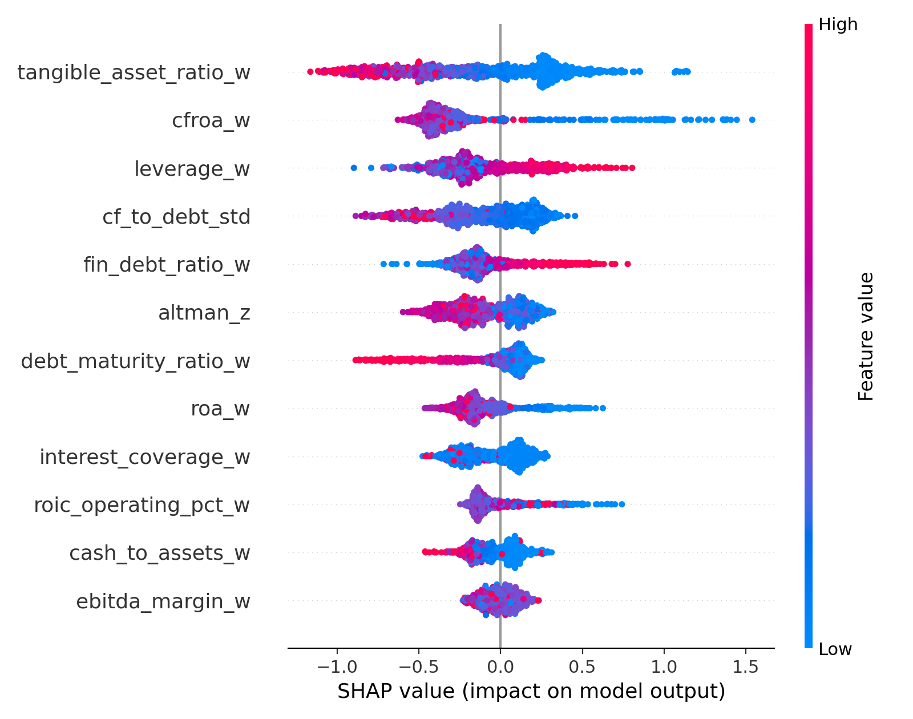

# Credit Risk Modeling for Corporate Default Prediction

**NYU ML in Finance**

> A two-stage, finance-aware credit risk pipeline: XGBoost discriminator + Isotonic Regression calibrator, validated with temporal walk-forward cross-validation on ~1M Italian corporate firm-years.

---

## Results

| Evaluation Set | Mean AUC | 95% Bootstrap CI |
|---|---|---|
| Walk-Forward (4 folds, pooled) | **0.837** | [0.832, 0.840] |
| Calibration Holdout (2012) | **0.851** | [0.844, 0.859] |
| Training Set | **0.883** | [0.880, 0.887] |

**Calibration impact** (Isotonic Regression on temporal holdout):

| Metric | Before | After | Change |
|---|---|---|---|
| Brier Score | 0.136 | 0.012 | −91% |
| AUC | 0.850 | 0.851 | +0.001 |

**Walk-Forward fold detail:**

| Fold | Train Window | Val Window | n_train | n_val | AUC | 95% CI |
|---|---|---|---|---|---|---|
| 2008 | < 2008-05-01 | 2008–2009 | 144,333 | 161,514 | 0.828 | [0.818, 0.838] |
| 2009 | < 2009-05-01 | 2009–2010 | 305,847 | 170,706 | 0.838 | [0.830, 0.846] |
| 2010 | < 2010-05-01 | 2010–2011 | 476,553 | 174,837 | 0.830 | [0.823, 0.838] |
| 2011 | < 2011-05-01 | 2011–2012 | 651,390 | 184,347 | 0.850 | [0.842, 0.857] |

Baseline logistic regression achieved AUC **0.812** on the same dataset — our calibrated XGBoost model outperforms it by **+3.9 points**.

---

## The Business Problem

Banca Massiccia, a large Italian bank, needs reliable 12-month Probability of Default (PD) estimates for corporate borrowers. A simple approve/deny classifier is insufficient — the bank needs a true, usable probability for three reasons:

| Problem | Description | Our Solution |
|---|---|---|
| **Financial** | Cannot price credit risk without a calibrated PD | Calibrated PD feeds directly into ECL = PD × LGD × EAD |
| **Operational** | Manual underwriting is slow, subjective, inconsistent | `harness.py` automates end-to-end scoring |
| **Regulatory** | IFRS 9 mandates statistically valid, calibrated PDs for provisioning | Isotonic calibration ensures PDs match real default rates |

---

## Why XGBoost over Logistic Regression

| | Logistic Regression | Raw XGBoost | Our Approach |
|---|---|---|---|
| Captures non-linearity | No | Yes | Yes |
| Handles class imbalance | Manually | `scale_pos_weight` | `scale_pos_weight` (~90) |
| Output is a true probability | Yes | No (uncalibrated) | Yes (isotonic calibration) |
| Interpretable features | Yes | Partial | Yes (12 finance-grounded ratios) |
| IFRS 9 / ECL ready | Yes | No | Yes |
| AUC (this dataset) | 0.812 | — | **0.851** |

Logistic regression is linear — it cannot capture that high leverage is only dangerous when combined with low cash flow. XGBoost captures these interactions natively. We then add calibration to convert raw scores into true, usable probabilities, which raw XGBoost alone cannot provide.

---

## Two-Stage Pipeline

```
Raw Financial Data
       │
       ▼
┌─────────────────────────────┐
│   preprocessing.py          │
│   Preprocessing_Pipeline    │
│   • Reconstruct balance     │
│     sheet items             │
│   • Engineer 12 ratios      │
│   • Winsorize (1st/99th %)  │
│   • Standardize (CF/Debt)   │
└─────────────┬───────────────┘
              │  12 features
              ▼
┌─────────────────────────────┐
│   Stage 1: XGBoost          │
│   model.joblib              │
│   • binary:logistic         │
│   • scale_pos_weight ≈ 90   │
│   • max_depth = 4           │
│   • early stopping (75 rds) │
│   → raw score ∈ [0, 1]      │
└─────────────┬───────────────┘
              │
              ▼
┌─────────────────────────────┐
│   Stage 2: Isotonic Calib.  │
│   calibrator.joblib         │
│   • Trained on 12-month     │
│     temporal holdout        │
│   • Maps raw score →        │
│     true PD probability     │
└─────────────┬───────────────┘
              │
              ▼
        Calibrated PD
```

Each script has a single responsibility:

| Script | Role |
|---|---|
| `preprocessing.py` | Defines all feature engineering logic — the only place transformations are written |
| `estimator.py` | Trains, validates, calibrates, and saves all artifacts |
| `predictor.py` | Loads artifacts and exposes `predict_pd(df)` |
| `harness.py` | CLI interface — the only entry point for production scoring |

---

## Feature Engineering

All 12 features are winsorized financial ratios grounded in the Altman (1968) / Ohlson (1980) credit-risk literature. Parameters (percentile bounds, means, stds) are learned on training data only and stored in `artifacts/meta.json` to prevent leakage.

| Feature | Formula | Economic Signal |
|---|---|---|
| `leverage_w` | Liabilities / Assets | Solvency buffer |
| `roa_w` | Operating Profit / Assets | Asset efficiency |
| `cfroa_w` | CF from Operations / Assets | Cash earnings quality |
| `tangible_asset_ratio_w` | Tangible Fixed Assets / Assets | Collateral value |
| `debt_maturity_ratio_w` | LT Debt / Total Debt | Refinancing risk |
| `roic_operating_pct_w` | Operating Profit / (Debt + Equity) | Capital efficiency |
| `altman_z` | 1.2·WC/TA + 1.4·RE/TA + 3.3·EBIT/TA + Sales/TA | Composite bankruptcy score |
| `cf_to_debt_std` | (CF/Debt − μ) / σ | Debt-service capacity (standardized) |
| `cash_to_assets_w` | Cash & Equiv. / Assets | Liquidity buffer |
| `fin_debt_ratio_w` | Non-bank Debt / Assets | Financial debt reliance |
| `interest_coverage_w` | EBITDA / Interest Expense | Debt-service ability |
| `ebitda_margin_w` | EBITDA / Revenue | Profitability margin |

### Key insights the model learned

1. **Collateral quality is the strongest signal.** `tangible_asset_ratio_w` is the top feature by SHAP importance — firms with few tangible assets have no collateral buffer and face sharply higher PD. Asset quality outranks even cash flow in predictive power.
2. **Cash flow dominates accounting profit.** `cfroa_w` (SHAP rank #2) and `cf_to_debt_std` (rank #4) together outrank `roa_w` (rank #8) — a firm can report accounting profits while burning cash and still default.
3. **Debt structure matters as much as leverage.** `debt_maturity_ratio_w` captures refinancing risk: heavy reliance on short-term debt is dangerous even at moderate total leverage.
4. **Altman Z still works.** The 1968 composite (rank #6) remains a strong predictor, confirming that working capital, retained earnings, and EBIT jointly capture distress.

### Partial dependence plots

Each plot shows how predicted PD changes as one feature varies, holding all others constant.

| | |
|---|---|
|  |  |
| **cf_to_debt_std:** Clear monotonic decrease — firms with negative cash flow relative to debt (left) have PD ~0.39; as debt-service capacity improves, PD falls to ~0.25. The relationship is nearly linear through the core of the distribution. | **cfroa_w:** Non-linear U-shape — highly loss-making firms (CFROA ≈ −5) have PD ~0.49, which falls sharply as cash returns improve. However, PD rises again at very high CFROA values (>8), likely reflecting extreme outliers in the tail of the distribution. |
|  |  |
| **roa_w:** Similar non-linear shape — negative ROA drives PD to ~0.43, which drops to ~0.29 as profitability improves to around 4–5%. PD rises modestly at very high ROA values, mirroring the cfroa_w pattern. The sharp inflection near zero is the most economically meaningful part. | **tangible_asset_ratio_w:** The clearest and most monotonic relationship of the four — PD drops steadily from ~0.48 (zero tangible assets, no collateral) to ~0.19 (90% tangible assets). Consistent with the SHAP ranking: this is the single most important feature in the model. |

These shapes confirm the model learned structural financial behaviour — not spurious correlations. The non-linearities in cfroa_w and roa_w at the extremes reflect genuine tail risk patterns that logistic regression would miss entirely.

### SHAP feature importance


`tangible_asset_ratio_w` and `cfroa_w` are the two dominant features. `leverage_w`, `cf_to_debt_std`, `fin_debt_ratio_w`, and `altman_z` form a second tier of roughly equal importance. `ebitda_margin_w` contributes the least — the model found that cash-flow based measures capture profitability more reliably than margin ratios alone.



The beeswarm confirms directionality: high `tangible_asset_ratio_w` (pink) pushes SHAP negative (lower PD); low values (blue) push positive. The same pattern holds for `cfroa_w` and `cf_to_debt_std`. For `leverage_w`, the direction flips — high leverage (pink) increases PD, as expected.

---

## Data & Problem Setup

- **Dataset:** Annual financial statements for Italian non-financial firms with > €1.5M assets
- **Unit:** One firm-year row (~1M rows total; 1.09% default rate)
- **Target construction:** A firm-year is labeled `default_12m = 1` if a default event occurs within 12 months of `avail_date` (= statement date + 4 months, reflecting the Italian reporting lag of 120–180 days)
- **Temporal split:** Train on `avail_date < 2012-05-01`; calibration holdout = final 12 months of training window
- **Class imbalance:** ~90:1 non-default to default ratio, handled via `scale_pos_weight`
- **Missing data:** Defaulters show dramatically higher missingness (ROE missing: 44% vs 6.5%; margin_fin missing: 34% vs 3.5%). Missing components are set to zero — economically interpreted as "absent or unreported" — and ratios are winsorized to limit noise

---

## Quick Start

### Prerequisites

```bash
pip install -r requirements.txt
```

### Run predictions on new data

```bash
python harness.py --input_csv new_borrowers.csv --output_csv predictions.csv
```

Output: single-column CSV of PD values (no header), one per row.

### Retrain from scratch

```bash
python default_flag.py    # construct default_12m from raw data
python estimator.py       # train, validate, calibrate, save artifacts
```

---

## Repo Structure

```
.
├── preprocessing.py          # Preprocessing_Pipeline class (train + transform)
├── estimator.py              # Training pipeline: walk-forward, calibration, save artifacts
├── predictor.py              # predict_pd(df) — loads artifacts, preprocesses, predicts
├── harness.py                # CLI entry point for scoring new data
├── default_flag.py           # Constructs default_12m target from raw def_date
├── requirements.txt
│
├── artifacts/
│   ├── model.joblib          # Trained XGBoost model
│   ├── calibrator.joblib     # Fitted isotonic calibrator
│   ├── meta.json             # Feature list + all preprocessing parameters
│   ├── bootstrap_results.json
│   ├── walk_forward_results.csv
│   ├── calibration_roc.png
│   └── interpretation/       # SHAP + PDP plots
│
├── notebooks/
│   ├── EDA.ipynb
│   ├── Fresh_EDA.ipynb
│   ├── Preprocessing.ipynb
│   └── Plot.ipynb
│
└── docs/
    └── Lavender Pitch Deck.pdf
```

---

## Model Specification

**XGBoost hyperparameters:**

| Parameter | Value | Reason |
|---|---|---|
| `objective` | `binary:logistic` | Output calibratable probabilities |
| `eval_metric` | `logloss` | Penalizes probability accuracy, not just rank |
| `n_estimators` | 500 (+ early stopping) | Stops at best iteration automatically |
| `early_stopping_rounds` | 75 | Prevents overfitting |
| `max_depth` | 4 | Shallow trees → lower variance |
| `min_child_weight` | 20 | No splits on fewer than 20 samples |
| `gamma` | 0.2 | Requires meaningful gain to split |
| `subsample` | 0.8 | Row subsampling per tree |
| `colsample_bytree` | 0.8 | Feature subsampling per tree |
| `scale_pos_weight` | ~90 (dynamic) | Corrects for 1.09% default rate |
| `learning_rate` | 0.05 | Slow, conservative learning |

**Calibration:** `sklearn.isotonic.IsotonicRegression` trained on a 12-month temporal holdout. Applied only if Brier score improves by > 0.001 without AUC degradation > 0.001.

---

## Validation Methodology

**Walk-forward (primary):** Expanding May-to-May windows simulate real production use — the model is never trained on future information. Each fold trains on all data before a cutoff and validates on the immediately following 12-month window.

**Bootstrap CI:** 2,000 resamples at 95% confidence, both per-fold and pooled across all validation data.

**Temporal calibration holdout:** The final 12 months of training data are withheld entirely from model training and used only to fit and evaluate the isotonic calibrator.

---

## Business Case & ROI

Because the model outputs a calibrated PD — not just a ranking — it plugs directly into the bank's core financial formulas.

**1. Loss Avoidance** via Expected Credit Loss:
```
ECL = PD × LGD × EAD
```
Our model provides the PD. The bank supplies LGD and EAD from its own records. Summing ECL across high-PD loans that a naive model would have approved directly quantifies annual loss avoided.

**2. Risk-Based Pricing** — the calibrated PD enables the bank to move from one-size-fits-all interest rates to borrower-specific pricing:
- Offer competitive rates to low-PD borrowers to win business
- Charge a risk premium on medium-PD borrowers to ensure each loan is profitable after expected loss

**3. Operational Efficiency** — `harness.py` automates the entire scoring pipeline, reducing underwriting time per application and freeing analysts for complex, high-value cases.

**4. Early Warning System** — re-scoring the existing portfolio annually flags clients whose PD has jumped significantly (e.g. 1.5% → 4.5%), enabling proactive intervention before a default occurs.

---

## Ethical Considerations & Limitations

**Legal (EU explainability):** GDPR and EU financial regulations require that automated decisions affecting borrowers be explainable. Our model's reliance on tangible financial ratios (not black-box features) makes it more auditable than most ML credit models. Post-hoc tools (partial dependence plots, SHAP) provide the required transparency.

**Bias by design:** The training data only includes firms with > €1.5M in assets. The model must not be used for small businesses or startups — it has no data to support those judgments. Geographic features (city, sector) were deliberately excluded to avoid penalising borrowers by location or industry.

**Model drift:** Trained on 2000–2012 data. Performance should be monitored continuously; retraining annually with new data is recommended.

**Scope — do not apply outside these boundaries:**

| Boundary | Reason |
|---|---|
| Non-financial Italian corporations only | Financial/insurance balance sheets have different structure |
| Firms > €1.5M in assets | Smaller firms not represented in training data |
| 12-month horizon only | Model is not calibrated for other loan product horizons |
| Italian economy only | Financial relationships are country-specific |

---

## References

- Altman, E.I. (1968). Financial ratios, discriminant analysis and the prediction of corporate bankruptcy. *Journal of Finance*, 23(4), 589–609.
- Ohlson, J.A. (1980). Financial ratios and the probabilistic prediction of bankruptcy. *Journal of Accounting Research*, 18(1), 109–131.
- Beaver, W.H. (1966). Financial ratios as predictors of failure. *Journal of Accounting Research*, 4, 71–111.
- Lessmann, S. et al. (2015). Benchmarking state-of-the-art classification algorithms for credit scoring. *European Journal of Operational Research*, 247(1), 124–136.
- Morini & Ruiz (2010). *Active Credit Portfolio Management in Practice*. Wiley Finance. (Chapters 4 & 7: Calibration and Model Validation)
- Edelberg, W. (2006). Risk-based pricing of interest rates in household loan markets. *Journal of Monetary Economics*, 53(8), 2283–2298.
- IFRS 9: Financial Instruments (2014). International Accounting Standards Board.
- Basel III: Finalising post-crisis reforms (2017). Bank for International Settlements.

